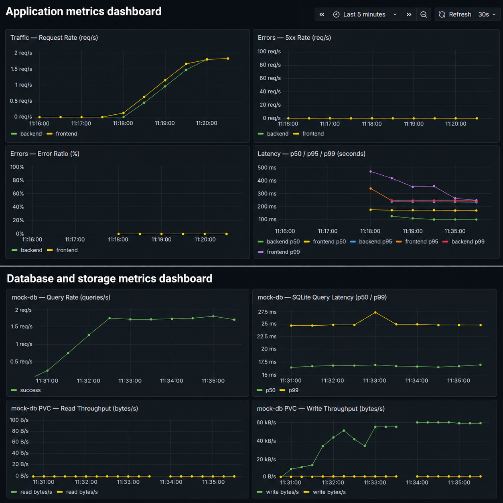
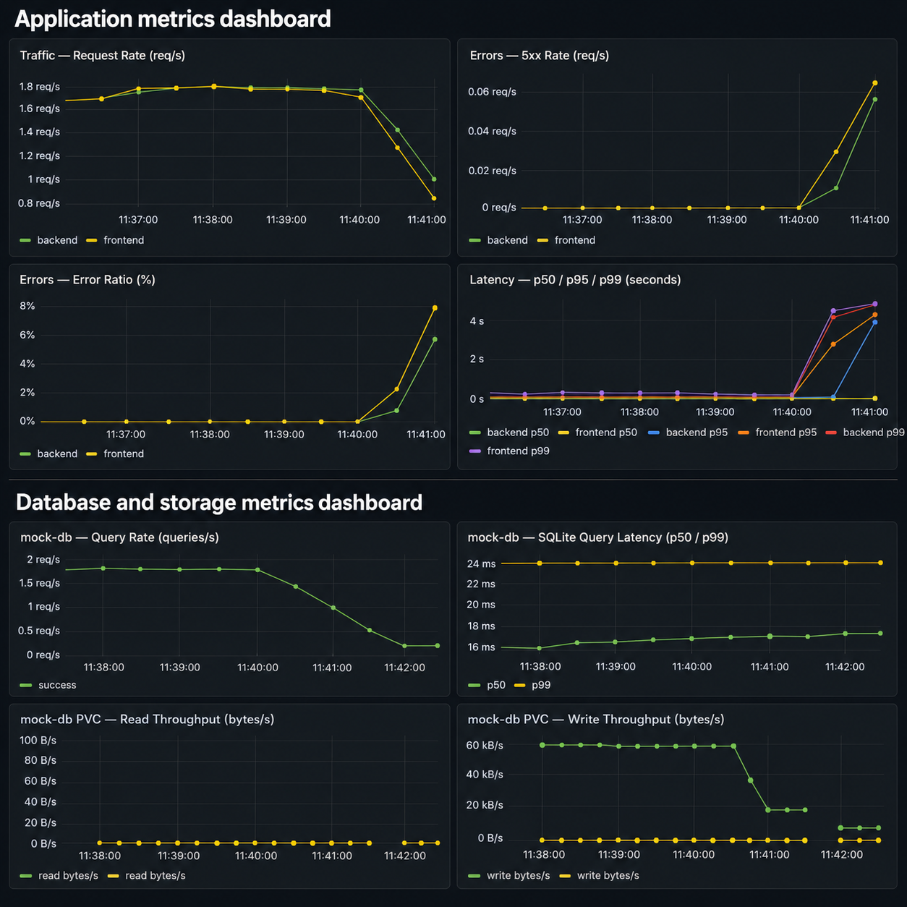
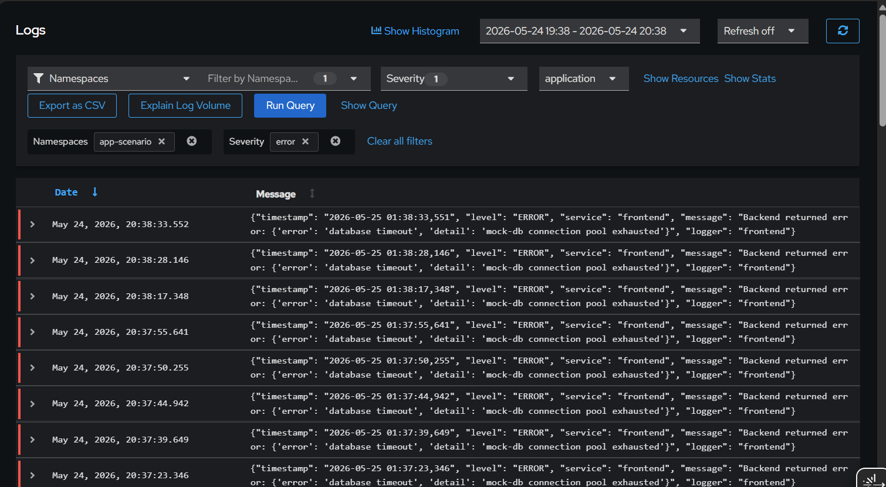
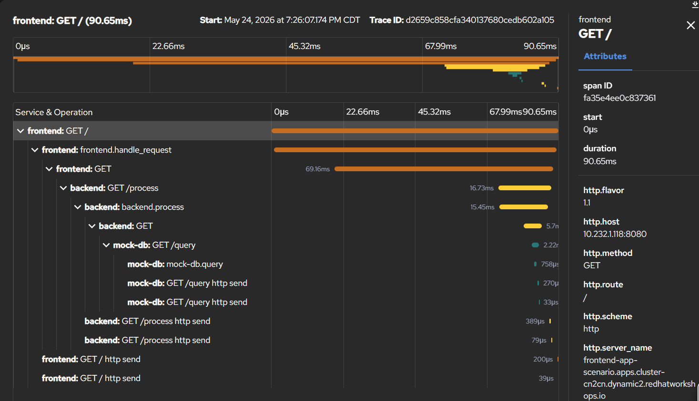
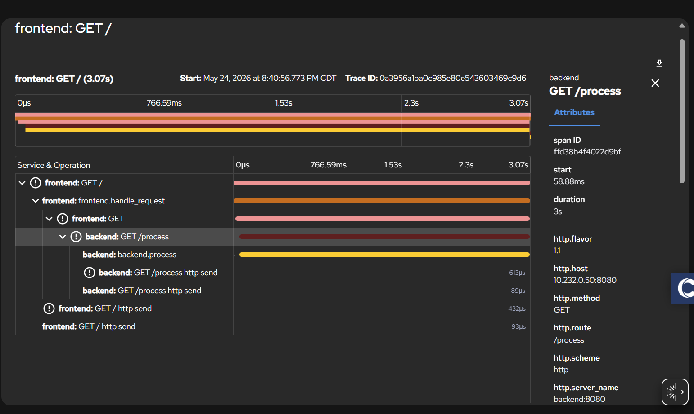
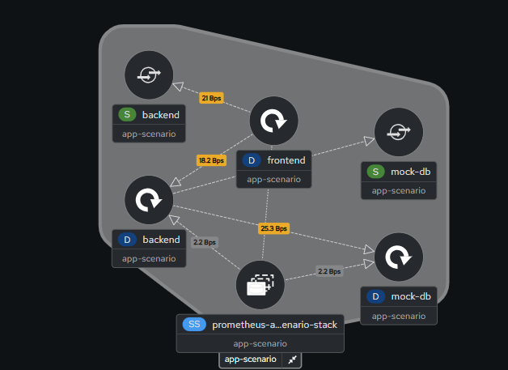
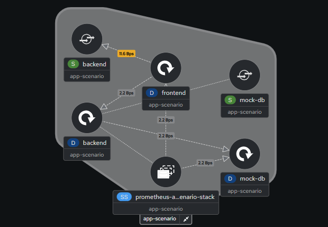
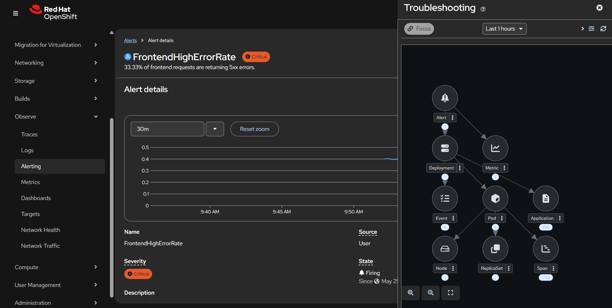
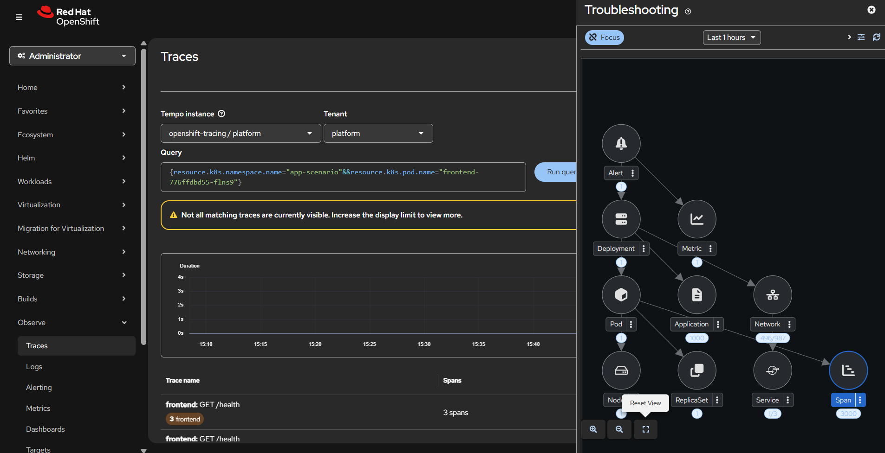

# OpenShift Correlated Observability — Hands-On Scenario

A complete, deployable scenario that demonstrates how to correlate metrics, logs, distributed traces, network flows, storage I/O, and Kubernetes events to identify the root cause of a service degradation — without leaving the OpenShift Console.

---

## The Troubleshooting Problem

A team gets paged at 2am. The frontend is throwing errors. Is it the application? The database? The network? The storage? An upstream dependency?

In most environments, answering that question means opening four or five different tools in sequence: a metrics dashboard in one tab, a log aggregator in another, a tracing backend somewhere else, and a network monitoring console if you are lucky enough to have one. By the time you have correlated the signals manually, you have lost time, context, and confidence in your conclusion.

The problem is not that the data is unavailable. The problem is fragmentation. Each tool sees one slice of the system. No single view connects them.

This scenario demonstrates a unified observability stack built entirely within OpenShift, using the Cluster Observability Operator (COO), Loki, Tempo, OpenTelemetry, Network Observability, Prometheus, and the Troubleshooting Panel UIPlugin powered by korrel8r. Every signal is accessible from within the OCP Console. A firing alert becomes the starting point — and from that one alert, you can reach logs, traces, network flows, and Kubernetes events without switching tools.

---

## What You Will Build and Test

### The Application

A three-service application deployed in the `app-scenario` namespace:

```
User → frontend (:8080) → backend (:8080) → mock-db (:8080)
                                                  │
                                            SQLite on PVC
                                            (1Gi persistent volume)
```

Each service is a Python FastAPI application instrumented with:
- **Prometheus metrics** — request count, latency histograms, error counters
- **OpenTelemetry traces** — distributed spans exported to an OTel Collector
- **Structured JSON logs** — collected by Vector and forwarded to Loki

The mock-db service backs every query with a real SQLite database on a PVC. Every `/query` call performs a `SELECT` and an `INSERT` into an audit table, generating real disk write I/O visible via cAdvisor.

### The Three Modes

| Mode | What happens | What you observe |
|------|-------------|-----------------|
| **Normal** | All services healthy, requests complete in < 100ms | Low error rate, low latency, all targets UP |
| **Degraded** | Backend activates internal failure mode: 3s latency on all requests, 40% return HTTP 503 | Frontend shows high error rate and latency. mock-db appears fine. |
| **Recovered** | Backend flag cleared | Metrics return to baseline within one scrape interval |

### The Core Challenge

The frontend logs contain: `"Backend returned error: {'detail': 'mock-db connection pool exhausted'}"`. This log message blames mock-db. A less experienced engineer stops here and starts investigating the database.

The database is fine. This scenario teaches you how to use correlated signals to find where the latency actually lives — and rule out every layer you did not need to touch.

---

## Architecture Overview

The application and all observability backends live in the cluster. The diagram below shows the full signal flow.

```
┌─────────────────────────────────────────────────────────────────┐
│  Namespace: app-scenario                                        │
│                                                                 │
│  ┌──────────┐   HTTP    ┌──────────┐   HTTP    ┌──────────┐    │
│  │ frontend │ ────────► │ backend  │ ────────► │ mock-db  │    │
│  │ :8080    │           │ :8080    │           │ :8080    │    │
│  └──────────┘           └──────────┘           └────┬─────┘    │
│                                                      │          │
│                                               SQLite on PVC     │
│       │ traces               │ traces               │ traces    │
│       └──────────────────────┴──────────────────────┘          │
│                              │                                  │
│                    ┌─────────────────┐                          │
│                    │  otel-collector  │                          │
│                    │  :4317 (gRPC)   │                          │
│                    └────────┬────────┘                          │
│                             │ OTLP                              │
│                          Tempo (cluster)                        │
│                                                                 │
│  Prometheus (MonitoringStack)  ←──── scrapes /metrics           │
│  Loki (LokiStack)              ←──── collects container logs    │
│  Network Observability         ←──── eBPF flow data             │
└─────────────────────────────────────────────────────────────────┘
```

Each observability backend receives data independently:

- **Prometheus** scrapes `/metrics` from all three pods every 30 seconds via ServiceMonitors
- **Loki** receives structured JSON logs from all pods via a Vector DaemonSet and ClusterLogForwarder
- **Tempo** receives OTLP trace spans from the OTel Collector, which enriches each span batch with Kubernetes pod metadata before forwarding
- **Network Observability** uses eBPF to capture pod-to-pod flow data at the kernel level — no instrumentation required
- **cAdvisor** on each node captures container filesystem I/O metrics, stored in the OCP platform Prometheus and accessible via Thanos Querier

---

## Signal Coverage

The following table maps each signal type to its source and where it appears in the OCP Console. Each signal is available independently, and all are reachable from a single firing alert via the Troubleshooting Panel.

| Signal | Source | Console location |
|--------|--------|-----------------|
| Metrics | Prometheus (MonitoringStack) | Observe → Dashboards / Metrics |
| Logs | Loki (ClusterLogForwarder) | Observe → Logs |
| Traces | Tempo (via OTel Collector) | Observe → Traces |
| Network flows | eBPF (FlowCollector) | Observe → Network Traffic |
| Storage I/O | cAdvisor (platform Prometheus) | Grafana dashboard |
| K8s events | Kubernetes API | Troubleshooting Panel sidebar |
| Correlated view | Troubleshooting Panel (korrel8r) | Observe → any signal → sidebar |

---

## Deployment Prerequisites

Before deploying, the following operators must be installed and reach `Succeeded` phase on your cluster. The deploy script does not install operators — it assumes they are already present.

| Operator / Component | Required for |
|---|---|
| OpenShift Data Foundation (ODF) | S3 bucket provisioning via NooBaa (Loki × 2, Tempo) |
| Cluster Observability Operator | MonitoringStack, UIPlugins |
| Red Hat OpenShift Logging + Loki Operator | Observe → Logs, ClusterLogForwarder |
| Tempo Operator | Observe → Traces |
| Red Hat build of OpenTelemetry Operator | OTel Collector |
| Network Observability Operator | Observe → Network Traffic |
| Grafana Operator | Grafana dashboards (optional but recommended) |

> **Storage:** ODF with NooBaa is required. The deploy script provisions three S3 buckets via `ObjectBucketClaim` — one each for Loki logging, Loki netobserv, and Tempo — and reads credentials directly from the OBC-generated Secrets. External S3 is not supported without manually pre-creating the storage secrets.

See `00-prerequisites/notes.md` for full installation instructions and verification commands.

---

## Running the Scenario

### Step 1 — Deploy the stack

Clone the repository and run the single deploy script from the repository root:

```bash
./build-and-deploy.sh
```

This script performs the following in order:
1. Creates the `app-scenario` namespace
2. Builds all three app images using OpenShift's internal registry
3. Deploys frontend, backend, mock-db, and otel-collector
4. Applies MonitoringStack, ServiceMonitors, and PrometheusRules
5. Applies ClusterLogForwarder, UIPlugins, and FlowCollector
6. Deploys Grafana with both app-level and platform Prometheus datasources

### Step 2 — Validate

Once the script completes, run the validation script to confirm every component is healthy before proceeding:

```bash
./08-scenario/validate-all.sh
```

This confirms all pods are running, routes are reachable, metrics are being scraped, and the Troubleshooting Panel UIPlugin is active.

### Step 3 — Establish a normal baseline

Before injecting failure, generate traffic so that Prometheus has enough data to establish a baseline. Run the following and let it run for at least 2–3 minutes:

```bash
./08-scenario/normal-mode.sh
```

This sends continuous traffic to the frontend at 5 requests per second and runs until interrupted with Ctrl+C. You should see consistent HTTP 200 responses.


*Baseline healthy state — error ratios near zero, latency low, all three targets UP.*

The Grafana dashboard shows all golden signals flat and healthy. This is the baseline you will compare against during the incident.

### Step 4 — Inject the failure

Stop the normal-mode script and run the failure injection:

```bash
./08-scenario/inject-failure.sh
```

This calls `POST /inject-failure` on the backend, which sets an internal `_degraded` flag. From this point, every request to `backend /process` receives 3 seconds of artificial latency, and 40% of requests return HTTP 503 with the message `"mock-db connection pool exhausted"`.

The health check still returns OK. The pod is running. The readinessProbe passes. From Kubernetes' perspective, everything is healthy.

Keep the script running — alerts need approximately 5 minutes of sustained traffic to fire. Then proceed to the investigation below.

---

## Investigating the Failure

The following walkthrough uses the actual signals produced by this scenario. Each step narrows the root cause until only one conclusion remains.

### Step 1 — The symptom: alert fires on frontend

Two to three minutes after injection, `FrontendHighErrorRate` fires. Navigate to OCP Console → Observe → Alerting to see it.

At this point you know: *the frontend has a high error rate*. You do not yet know why.


*After failure injection — frontend and backend error ratios spiking, backend p99 latency at 3+ seconds. mock-db latency is flat and normal. All targets are still UP.*

Notice what the dashboard is already telling you: mock-db latency is completely normal. The database is not struggling. Something upstream of mock-db is failing. This is the first clue — and it comes before you open a single log.

Opening the alert in the OCP Console and clicking the Troubleshooting Panel sidebar surfaces the frontend pod logs immediately. They contain:

```
frontend: "Backend returned error: {'error': 'database timeout', 'detail': 'mock-db connection pool exhausted'}"
```

The log blames mock-db. A less experienced engineer might stop here. This scenario is designed to challenge that instinct.

### Step 2 — Metrics: is the backend also degraded?

Before investigating mock-db, check whether the backend itself is healthy. Run the following PromQL queries in OCP Console → Observe → Metrics:

```promql
job:http_requests_error_ratio:rate5m{job="backend"}
job:http_request_duration_seconds:p99{job="backend"}
histogram_quantile(0.99, rate(db_query_duration_seconds_bucket[5m]))
```

What you see:
- Backend error ratio: ~40% — elevated
- Backend p99 latency: 3+ seconds — elevated
- mock-db query latency: 5–50ms — **completely normal**

The database is not the problem. The backend is degraded but mock-db is healthy. The new hypothesis: the backend is failing *before* it ever reaches mock-db.

### Step 3 — Logs: what is the backend saying?

Filter logs to `namespace=app-scenario`, `application=backend`, `severity=warning/error`:

```
backend: "Degraded mode: injecting 3.0s latency before db call"
backend: "Database connection timeout — mock-db did not respond within threshold"
```


*Backend logs during the incident — degraded mode warnings and database timeout errors timestamped to the failure window.*

The backend is generating synthetic errors. It is not a real database timeout — the backend has an internal flag that adds latency and returns errors before the database is ever contacted. The log message that blamed mock-db was produced by the backend, not by mock-db itself.

### Step 4 — Traces: where does the latency live?

Open OCP Console → Observe → Traces and filter for slow traces (duration > 2s). A degraded trace looks like this:

```
frontend.handle_request   [3.1s total]
└── GET /process          [3.1s — HTTP call to backend]
    └── backend.process   [3.1s]
        (no child span)
```

Compare this to a healthy baseline trace:

```
frontend.handle_request   [~50ms total]
└── GET /process          [~45ms]
    └── backend.process   [~40ms]
        └── GET /query    [~30ms]
            └── mock-db.query [~20ms]
                  db.system: sqlite
                  db.name: /data/mock-db.db
```


*Healthy trace — all four spans visible, total duration under 100ms: frontend → backend → mock-db.*


*Degraded trace — 3+ second duration, `backend.process` has no child span. The `mock-db.query` span is completely absent, proving the backend never reached the database.*

The `mock-db.query` span is completely absent in the slow trace. The entire 3s latency is contained inside `backend.process` — no downstream call was made. If the database were causing the problem, you would see a *slow* `mock-db.query` span, not a *missing* one.

This single trace is sufficient to conclude that mock-db is not involved.

### Step 5 — Storage I/O: rule out disk pressure

Even with trace evidence, a thorough investigation closes every argument. Someone will ask: *could the PVC have been under I/O pressure before the backend even attempted to connect?*

The Grafana dashboard includes dedicated storage I/O panels pulling container filesystem metrics from the OCP platform Prometheus (cAdvisor). These panels show write throughput for the mock-db pod in real time.

Under normal operation, every `/query` call triggers an `INSERT` into the `query_log` audit table followed by `commit()`, which forces a physical disk flush. Write throughput climbs steadily with request volume. During the incident window, the write throughput panel drops to near zero — not because the disk is struggling, but because no query ever arrived to generate a write.

Flat write I/O during an active incident means one thing: the database was never reached. This panel independently corroborates the trace evidence.

> **Note on read throughput:** SQLite's 100-record working set fits entirely in the OS page cache after the first access. Read throughput is always near zero regardless of load and is not a useful incident signal. Write throughput is the meaningful metric here.

### Step 6 — Network flows: confirm mock-db received no traffic

Navigate to OCP Console → Observe → Network Traffic → Traffic flows. Filter by:
- Source namespace = `app-scenario`
- Destination namespace = `app-scenario`
- Source owner = `backend`


*Normal operation — backend → mock-db traffic visible with consistent flow volume.*


*After failure injection — backend → mock-db flows absent, while frontend → backend traffic remains active.*

During the incident window, traffic from `backend` to `mock-db` drops significantly. The frontend continues sending requests to the backend at full volume, but the backend stops forwarding them to mock-db for the 40% of requests that return 503 immediately. Three independent signals — traces, storage I/O, and network flows — all agree.

### Step 7 — Infrastructure: rule out pod-level failures

Back in the Troubleshooting Panel: no OOMKilled events, no CrashLoopBackOff, no scheduling failures. The backend pod has been running continuously with its readinessProbe passing throughout the incident.

---

## Root Cause Evidence

| Layer | Finding |
|-------|---------|
| Frontend | High error rate and latency — symptom only |
| Backend | Internal `_degraded=true` flag active — root cause |
| mock-db | Healthy; SQLite queries complete in < 50ms |
| mock-db PVC I/O | Write throughput flat during incident — database never reached |
| Network flows | No flows from backend to mock-db during incident window |
| Infrastructure | No pod restarts, no OOM, no scheduling issues |

**Root cause confirmed:** Application-level degradation in the backend service. The backend pod is healthy by every infrastructure metric — but has an internal flag that adds 3 seconds of latency and returns errors for 40% of requests, simulating a connection-pool exhaustion scenario that it projects onto mock-db in its error messages.

### Restore and recovery

```bash
./08-scenario/restore-normal.sh
```

This calls `POST /restore` on the backend, which clears the `_degraded` flag immediately. The frontend error rate returns to baseline within one Prometheus scrape interval (~30 seconds). The script then sends continuous traffic so you can watch the recovery in Grafana in real time.

---

## The Troubleshooting Panel: One Alert, Every Signal

The OCP Troubleshooting Panel is a UIPlugin powered by **korrel8r**, a signal correlation engine. When you open an alert instance in the OCP Console and click the Troubleshooting Panel sidebar, korrel8r walks a graph of rules to find all signals related to that alert.

Starting from `FrontendHighErrorRate`, the panel surfaces:

| Signal category | What it shows |
|----------------|--------------|
| `alert:alert` | The firing alert instance |
| `metric:metric` | Frontend request rate and error rate |
| `log:application` | Recent logs from the frontend pod |
| `k8s:Event` | Kubernetes events for the frontend deployment |
| `k8s:Pod` | Frontend pod status and details |
| `netflow:network` | Network flows to and from the frontend pod |
| `trace:span` | Traces tagged with the frontend pod name |


*FrontendHighErrorRate alert detail with the Troubleshooting Panel open — all signal categories (metrics, logs, traces, network flows, k8s events) correlated from a single alert.*

Each category is one click to expand. From the alert, you reach logs without navigating to Observe → Logs. You reach traces without navigating to Observe → Traces. You reach network flows without navigating to Observe → Network Traffic. The correlation happens automatically.


*One signal category expanded — one click from the alert to the correlated log entries or trace spans.*

---

## How Correlation Works Under the Hood

Understanding how korrel8r connects signals helps you extend this scenario and diagnose cases where correlation does not surface expected results.

### Required observability components

korrel8r can only surface a signal type if the backing store is deployed and reachable. Each signal type in the panel depends on a specific component being present:

| Signal in panel | Required component |
|----------------|-------------------|
| `log:application` | LokiStack + ClusterLogForwarder (`04-logging/`) |
| `trace:span` | TempoMonolithic + OTel Collector (`05-tracing/`) |
| `netflow:network` | FlowCollector + NetObserv LokiStack (`06-netflow/`) |
| `k8s:Event`, `k8s:Pod` | Kubernetes API — always available |
| `metric:metric` | Prometheus (UWM or MonitoringStack — `03-observability/`) |

If any component is missing, korrel8r silently returns zero results for that signal type. The panel still opens — it just shows fewer signal categories. This is the most common reason correlation appears incomplete.

### Why alert rules need a `deployment` label

korrel8r's `AlertToDeployment` rule uses `{{.Labels.deployment}}` to navigate from a firing alert to a Kubernetes Deployment. Without this label, the correlation chain stops at the alert — no logs, traces, events, or network flows are surfaced, regardless of what is deployed.

Every alert in `03-observability/prometheusrules.yaml` already includes this label:

```yaml
labels:
  severity: critical
  deployment: frontend   # ← required by korrel8r AlertToDeployment rule
```

If you add new alert rules to this scenario, include a `deployment` label matching the exact Deployment name.

### Why traces need Kubernetes resource attributes

korrel8r's `PodToTrace` rule queries Tempo for spans tagged with `k8s.pod.name`. Without this attribute in the trace resource, traces are never surfaced in the Troubleshooting Panel even if they exist in Tempo.

The three required attributes are:

| Attribute | Example value | Used by |
|-----------|--------------|---------|
| `k8s.pod.name` | `frontend-6d8f9b-xk2p` | korrel8r `PodToTrace` rule |
| `k8s.namespace.name` | `app-scenario` | korrel8r scoping |
| `k8s.deployment.name` | `frontend` | Tempo tag filtering |

Both mechanisms below are already implemented in this repository. You do not need to make any changes — this section explains how they work so you can replicate the pattern in your own applications.

- Option A is configured in `05-tracing/otel-collector.yaml`
- Option B is configured in `02-apps/deployments.yaml` for all three services

#### Option A — Collector-side enrichment (k8sattributesprocessor)

The OTel Collector in `05-tracing/otel-collector.yaml` is configured with the `k8sattributesprocessor`. It enriches every incoming span batch by resolving the source IP of the gRPC connection against the Kubernetes pod cache and attaching pod metadata automatically:

```yaml
processors:
  k8sattributes:
    auth_type: serviceAccount   # reads pods via the otel-collector ServiceAccount
    pod_association:
      - sources:
        - from: connection      # resolves the sending pod by its connection IP
```

The collector's `ServiceAccount` and `ClusterRole` grant the necessary `get/list/watch` permissions on pods and namespaces.

> **Note:** Spans exported immediately after a cold collector restart may be missing k8s attributes until the pod-watch cache warms (typically within a few seconds of startup).

#### Option B — Deployment manifest env var (OTEL_RESOURCE_ATTRIBUTES)

`OTEL_RESOURCE_ATTRIBUTES` is set in `02-apps/deployments.yaml` for all three applications. The OTel SDK reads this environment variable at startup and merges it into the span resource:

```yaml
env:
  - name: POD_NAME
    valueFrom:
      fieldRef:
        fieldPath: metadata.name
  - name: POD_NAMESPACE
    valueFrom:
      fieldRef:
        fieldPath: metadata.namespace
  - name: OTEL_RESOURCE_ATTRIBUTES
    value: "k8s.pod.name=$(POD_NAME),k8s.namespace.name=$(POD_NAMESPACE),k8s.deployment.name=frontend"
```

> **Note:** If your application calls `Resource.create({...})` with an explicit dict, that dict takes precedence and this env var is silently ignored. In that case, either enrich the dict to read `POD_NAME` and `POD_NAMESPACE` from the environment, or rely solely on Option A.

---

## Resource Requirements

The table below shows the request footprint of components deployed by this scenario. Platform overhead — operators, OCP monitoring, DNS — is excluded and already present on the nodes.

| Component | CPU request | Memory request | Notes |
|---|---|---|---|
| frontend + backend + mock-db | 30m | 192 Mi | mock-db uses a 1Gi PVC for SQLite storage |
| OTel Collector | 50m | 128 Mi | |
| MonitoringStack Prometheus | 100m | 256 Mi | |
| TempoMonolithic | ~500m | ~1 GiB | |
| Logging LokiStack (`1x.pico`, 7 pods) | ~500m | ~400 Mi | Actual observed ~40Mi/pod |
| NetObserv LokiStack (`1x.pico`, 7 pods) | ~500m | ~400 Mi | Same |
| Vector / ClusterLogForwarder (DaemonSet) | ~150m | ~768 Mi | 256Mi request × 3 nodes; 1Gi limit per pod |
| FlowCollector eBPF agent + processor | ~200m | ~350 Mi | |
| **Scenario total** | **~2.1 CPU** | **~3.5 GiB** | |

**Minimum recommended per worker node: 8 CPU / 24 GiB RAM**

On a freshly provisioned cluster, roughly half of each worker's capacity is already consumed by platform components. Two 8 CPU / 24 GiB workers leave approximately 9 CPU and 26 GiB free — enough to absorb the scenario stack with headroom.

---

## Repository Structure

```
observability_scenario/
├── README.md                          # Original README
├── README-2.md                        # This document
├── root-cause-template.md             # Guided RCA worksheet
├── build-and-deploy.sh                # One-shot build + deploy script
├── 00-prerequisites/
│   └── notes.md                       # Operator install guide + verification
├── 01-namespaces/
│   └── namespace.yaml
├── 02-apps/
│   ├── imagestreams.yaml
│   ├── buildconfigs.yaml
│   ├── pvc.yaml
│   ├── deployments.yaml
│   ├── services.yaml
│   └── routes.yaml
├── 03-observability/
│   ├── monitoringstack.yaml
│   ├── servicemonitors.yaml
│   ├── prometheusrules.yaml
│   ├── grafana-dashboard.yaml
│   └── grafana-platform-datasource.yaml
├── 04-logging/
│   ├── clusterlogforwarder.yaml
│   ├── logging-uiplugin.yaml
│   └── rbac.yaml
├── 05-tracing/
│   ├── otel-collector.yaml
│   └── distributed-tracing-uiplugin.yaml
├── 06-netflow/
│   └── flowcollector.yaml
├── 07-uiplugins/
│   ├── monitoring-uiplugin.yaml
│   └── troubleshooting-panel-uiplugin.yaml
├── 08-scenario/
│   ├── normal-mode.sh
│   ├── inject-failure.sh
│   ├── restore-normal.sh
│   ├── validate-all.sh
│   └── investigation-guide.md
├── images/
│   └── *.png                          # Screenshots referenced in this document
└── apps/
    ├── frontend/
    ├── backend/
    └── mock-db/
```

---

## PromQL Quick Reference

The following queries are used during the investigation walkthrough and are available in OCP Console → Observe → Metrics.

```promql
# Request rate per service
rate(http_requests_total[5m])

# Error ratio per service (recording rule)
job:http_requests_error_ratio:rate5m

# p99 latency per service (recording rule)
job:http_request_duration_seconds:p99

# mock-db query latency
histogram_quantile(0.99, rate(db_query_duration_seconds_bucket[5m]))

# All targets up?
up{namespace="app-scenario"}
```

---

## Renaming the Namespace

The scenario deploys into `app-scenario` by default. If you need to use a different namespace, the following files contain hardcoded references that must all be updated together. Changing only the namespace metadata is not sufficient.

| File | What is hardcoded | Impact if not updated |
|---|---|---|
| `02-apps/services.yaml` | `monitoring.rhobs/stack: app-scenario` label | MonitoringStack will not discover services |
| `03-observability/monitoringstack.yaml` | `namespaceSelector: [app-scenario]` | Prometheus will not scrape the namespace |
| `03-observability/prometheusrules.yaml` | `namespace="app-scenario"` in PromQL | Alert expressions will be wrong |
| `03-observability/uwm-prometheusrules.yaml` | `namespace="app-scenario"` in PromQL | Same as above |
| `03-observability/grafana-datasource.yaml` | `app-scenario-stack-prometheus.app-scenario.svc` URL | Grafana cannot reach Prometheus |
| `04-logging/clusterlogforwarder.yaml` | `namespaces: [app-scenario]` input filter | Logs will not be collected from the namespace |
| `05-tracing/tempomonolithic.yaml` | `tenantId` contains `app-scenario` | Cosmetic only |

---

## Cleanup

To remove all scenario resources from the cluster, run the following commands. Do not delete the FlowCollector if other teams or namespaces depend on it.

```bash
oc delete namespace app-scenario
oc delete uiplugin monitoring distributed-tracing logging troubleshooting-panel
# Do NOT delete FlowCollector if other teams use it
```

This removes the application pods, MonitoringStack, LokiStack, TempoMonolithic, OTel Collector, UIPlugins, and all associated resources. Platform operators remain installed and unaffected.

---

## Conclusion

This scenario demonstrates something that matters in production: the symptom and the root cause are rarely in the same place. The frontend was noisy. The alerts fired on the frontend. The logs mentioned mock-db. But the root cause was the backend — a pod that passed every health check while internally failing 40% of requests.

Finding that required correlating five independent signals:

- **Metrics** showed the symptom — frontend errors and latency — and immediately cleared mock-db by showing its query latency was normal
- **Logs** confirmed the backend was the source of the error messages, not a passive reporter of a database failure
- **Traces** proved that the backend owned all of the latency — the `mock-db.query` span was absent, meaning the database was never contacted
- **Storage I/O** ruled out disk pressure — write throughput dropped to zero because no queries arrived, not because the disk was struggling
- **Network flows** confirmed that backend-to-mock-db traffic dropped during the incident, independently corroborating the trace evidence

None of these signals required switching to an external tool. Every signal was accessible from the OCP Console. The Troubleshooting Panel linked them all from the first firing alert — reducing the time between "alert fires" and "root cause confirmed" from minutes of tab-switching to a single investigation workflow.
